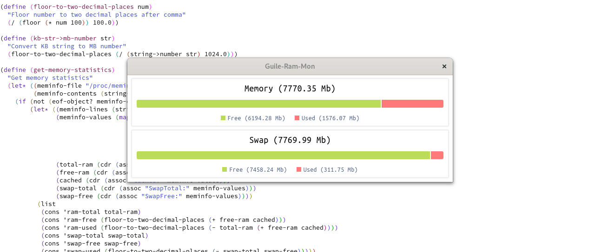

# guile-ram-mon

Tool for viewing information about RAM usage written in GNU Guile

### Dependencies
- [guile-json](https://github.com/aconchillo/guile-json)
- [guile-webview](https://github.com/KikyTokamuro/guile-webview)

### Run
```sh
chmod +x ram-mon.scm
./ram-mon.scm
```

### Screenshot
